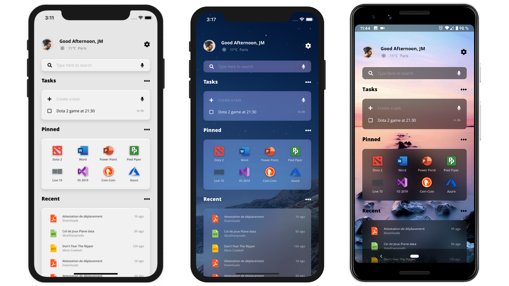

# Sharpnado Acrylic

Where **Sharpnado** is experimenting Acrylic effects.




`MaterialFrame.xaml` file:

```xml
<ResourceDictionary xmlns="http://xamarin.com/schemas/2014/forms"
                    xmlns:x="http://schemas.microsoft.com/winfx/2009/xaml"
                    xmlns:rv="clr-namespace:Sharpnado.Presentation.Forms.RenderedViews;assembly=Sharpnado.Presentation.Forms">

    <ResourceDictionary.MergedDictionaries>
        <ResourceDictionary Source="Colors.xaml" />
    </ResourceDictionary.MergedDictionaries>

    <Style TargetType="rv:MaterialFrame">
        <Setter Property="Margin" Value="5, 5, 5, 10" />
        <Setter Property="Padding" Value="20,15" />
        <Setter Property="CornerRadius" Value="10" />
        <Setter Property="LightThemeBackgroundColor" Value="{StaticResource AcrylicFrameBackgroundColor}" />
        <Setter Property="MaterialTheme" Value="{DynamicResource DynamicMaterialTheme}" />
        <Setter Property="MaterialBlurStyle" Value="{DynamicResource DynamicBlurStyle}" />
    </Style>

</ResourceDictionary>
```

`Color.xaml` file:

```xml
<?xml version="1.0" encoding="UTF-8" ?>
<?xaml-comp compile="true" ?>

<ResourceDictionary xmlns="http://xamarin.com/schemas/2014/forms" xmlns:x="http://schemas.microsoft.com/winfx/2009/xaml">

    <Color x:Key="AcrylicSurface">#E6E6E6</Color>

    <Color x:Key="AcrylicFrameBackgroundColor">#F1F1F1</Color>

    <Color x:Key="AccentColor">#00E000</Color>

    <Color x:Key="PrimaryColor">Black</Color>
    <Color x:Key="SecondaryColor">#60000000</Color>
    <Color x:Key="TernaryColor">#30000000</Color>

    <Color x:Key="PrimaryDarkColor">White</Color>
    <Color x:Key="SecondaryDarkColor">#80FFFFFF</Color>
    <Color x:Key="TernaryDarkColor">#50FFFFFF</Color>

    <Color x:Key="TextPrimaryColor">Black</Color>
    <Color x:Key="TextSecondaryColor">#60000000</Color>
    <Color x:Key="TextTernaryColor">#40000000</Color>

    <Color x:Key="TextPrimaryDarkColor">White</Color>
    <Color x:Key="TextSecondaryDarkColor">#80FFFFFF</Color>
    <Color x:Key="TextTernaryDarkColor">#50FFFFFF</Color>

</ResourceDictionary>
```

`ResourcesHelper.cs`

```csharp
public static void SetAcrylic(bool isBlurEnabled)
{
    if (isBlurEnabled)
    {
        SetDynamicResource(DynamicMaterialTheme, MaterialFrame.MaterialFrame.Theme.AcrylicBlur);
        SetDynamicResource(DynamicBackgroundColor, Color.Transparent);
        return;
    }
    
    SetDynamicResource(DynamicMaterialTheme, MaterialFrame.MaterialFrame.Theme.Acrylic);
    SetDynamicResource(DynamicBackgroundColor, "AcrylicSurface");
    SetDynamicResource(DynamicBackgroundImageSource, new FileImageSource());
    SetLightColors(false);
}

...

public static void SetBlurStyle(MaterialFrame.MaterialFrame.BlurStyle blurStyle)
{
    switch (blurStyle)
    {
        case MaterialFrame.MaterialFrame.BlurStyle.Light:
            SetDarkColors(false);
            SetDynamicResource(
                DynamicBackgroundImageSource,
                new FileImageSource
                    {
                        File = Device.RuntimePlatform == Device.iOS ? "catalina_dark.jpg" : "bing_dark.jpg"
                    });
            break;

        case MaterialFrame.MaterialFrame.BlurStyle.Dark:
            SetDarkColors(true);
            SetDynamicResource(
                DynamicBackgroundImageSource,
                new FileImageSource
                    {
                        File = Device.RuntimePlatform == Device.iOS
                                   ? "catalina_light.jpg"
                                   : "milky_light.jpg"
                    });
            break;

        case MaterialFrame.MaterialFrame.BlurStyle.ExtraLight:
            SetLightColors(true);
            SetDynamicResource(
                DynamicBackgroundImageSource,
                new FileImageSource
                    {
                        File = Device.RuntimePlatform == Device.iOS
                                   ? "undersea_light.jpg"
                                   : "bing_light.jpg"
                    });
            break;
    }

    SetDynamicResource(DynamicBlurStyle, blurStyle);
}

...

public static void SetLightColors(bool darkBackground)
{
    SetDynamicResource(DynamicHeaderTextColor, "TextPrimaryColor");

    SetDynamicResource(DynamicPrimaryOnBackgroundColor, darkBackground ? "PrimaryDarkColor" : "PrimaryColor");
    SetDynamicResource(DynamicSecondaryOnBackgroundColor, darkBackground ? "SecondaryDarkColor" : "SecondaryColor");

    SetDynamicResource(DynamicPrimaryColor, "PrimaryColor");
    SetDynamicResource(DynamicSecondaryColor, "SecondaryColor");

    SetDynamicResource(DynamicTextPrimaryColor, "TextPrimaryColor");
    SetDynamicResource(DynamicTextSecondaryColor, "TextSecondaryColor");
    SetDynamicResource(DynamicTextTernaryColor, "TextTernaryColor");

    SetDynamicResource(DynamicLabelAppsColor, "LabelAppsColor");
}

public static void SetDarkColors(bool lightBackground)
{
    SetDynamicResource(DynamicHeaderTextColor, "TextPrimaryDarkColor");

    SetDynamicResource(DynamicPrimaryOnBackgroundColor, lightBackground ? "PrimaryColor" : "PrimaryDarkColor");
    SetDynamicResource(DynamicSecondaryOnBackgroundColor, lightBackground ? "SecondaryColor" : "SecondaryDarkColor");

    SetDynamicResource(DynamicPrimaryColor, "PrimaryDarkColor");
    SetDynamicResource(DynamicSecondaryColor, "SecondaryDarkColor");

    SetDynamicResource(DynamicTextPrimaryColor, "TextPrimaryDarkColor");
    SetDynamicResource(DynamicTextSecondaryColor, "TextSecondaryDarkColor");
    SetDynamicResource(DynamicTextTernaryColor, "TextTernaryDarkColor");

    SetDynamicResource(DynamicLabelAppsColor, "LabelAppsDarkColor");
}
```


Component used:

  * [``Sharpnado.MaterialFrame``](https://github.com/roubachof/Sharpnado.MaterialFrame)